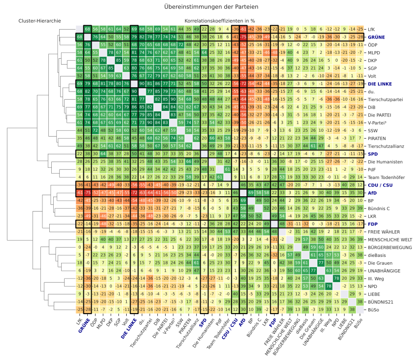
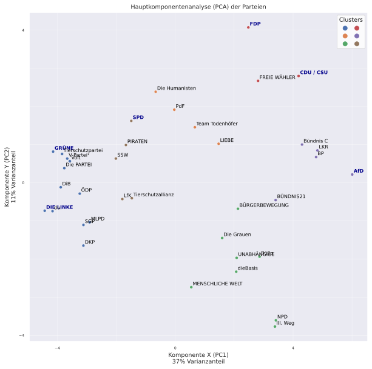
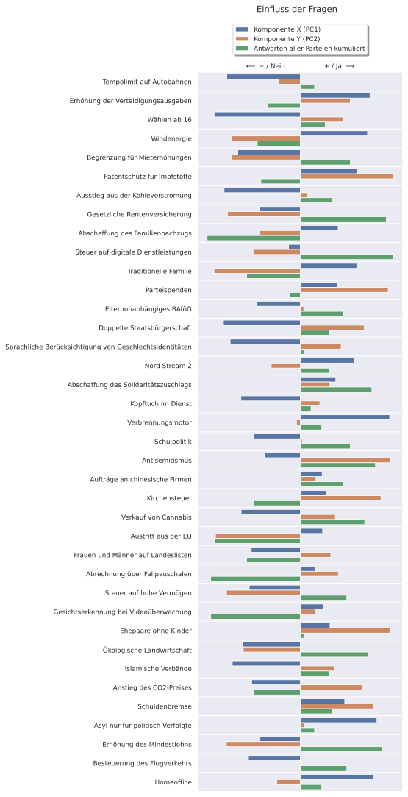

# wahlomat_analysis

This script analyses www.wahl-o-mat.de German political party data.

It generates a correlation matrix and a principal component analysis map, where also clusters are marked.

The code is inspired by Reddit users /u/d_loose/ and /u/askLubich/.

For more information about the analysis check out [askLubich's repo](https://github.com/askLubich/Wahl-O-Mat-EU-2019) or his [German explanation](https://www.reddit.com/r/de/comments/bqubdv/wahlomat_analyse_zur_euparlamentswahl_2019_oc/eo7zmaq/).

Pull request and other improvements are welcome.

## Running

You can open the notebook in your browser by clicking [the badge above](https://mybinder.org/v2/gh/microraptor/wahlomat_analysis/HEAD?filepath=wahlomat_analysis.ipynb). Then you can click the run button repeatedly to run each cell. It takes a moment for the plots to pop up.

The .py and .ipynb files in this repo do the same thing and have almost identical code.

## Bundestagswahl 2021

### Correlation Matrix

### Principal Component Analysis

#### Principal Component Influences

